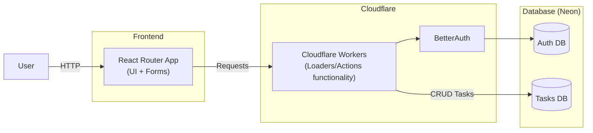

# TO-DO app

### Notes

- The Neon Postgres database is accessed via **HTTP/REST** using Neon’s serverless driver, which is compatible with the Cloudflare Workers runtime (no TCP connections).
- Authentication is handled by **BetterAuth**, with session validation enforced inside React Router **loaders and actions**.
- The application is deployed entirely on **Cloudflare Workers**, avoiding a separate backend service.
