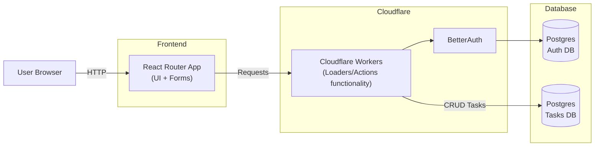

# TO-DO app

```mermaid
flowchart LR
    User[User Browser]

    subgraph Frontend
        RR["React Router App<br/>(UI + Forms)"]
    end

    subgraph Cloudflare
        CFW["Cloudflare Workers<br/>(Loaders/Actions functionality)"]
        BA["BetterAuth"]
    end

    subgraph Database
        AuthDB[("Postgres<br/>Auth DB")]
        TasksDB[("Postgres<br/>Tasks DB")]
    end

    User -->|HTTP| RR
    RR -->|Requests| CFW

    CFW --> BA
    BA --> AuthDB

    CFW -->|CRUD Tasks| TasksDB
```